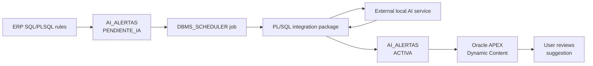

# Oracle APEX AI Suggestions for ERP Workflows

## Oracle Products Used

- Oracle APEX
- Oracle Database
- PL/SQL
- SQL
- SQLcl
- DBMS_SCHEDULER
- UTL_HTTP
- ORDS

## Contribution Type

- Product Usage
- GitHub Code
- Screenshots
- Video Demo

## Date Created

June 2026

## Summary

This contribution demonstrates hands-on Oracle APEX product usage by rendering
AI-assisted operational suggestions inside ERP dashboards and workflow pages.
Oracle APEX is used as the application and user experience layer. Oracle
Database and PL/SQL provide business context, security filters, background
processing, and HTML rendering through CLOB-based Dynamic Content regions.

The AI text is generated by an external local inference service. The Oracle
product usage demonstrated here is the APEX page design, PL/SQL integration,
database-backed alert lifecycle, scheduler-based processing, and final user
experience inside the ERP.

## What I Built

- A reusable APEX suggestion region for ERP dashboards.
- A PL/SQL CLOB rendering pattern for Oracle APEX Dynamic Content.
- A database-backed alert lifecycle using `AI_ALERTAS`.
- Background processing with `DBMS_SCHEDULER`.
- Sanitized SQL and PL/SQL examples for public documentation.
- A video walkthrough script and screenshot checklist for ACE submission.

## Architecture



## APEX Pattern

The APEX page uses a Dynamic Content region or a dashboard package that returns
HTML as CLOB:

```plsql
RETURN app_ia_alertas_pq.dashboard_sugerencias_clob(
  p_no_cia          => :GLOBAL_CIA,
  p_centros         => :GLOBAL_CENTRO,
  p_modulo          => 'FACTURACION',
  p_dashboard_scope => 'GENERAL',
  p_usuario         => :APP_USER,
  p_limite          => 5
);
```

## Evidence Included

- [Product usage documentation](docs/oracle-apex-ai-suggestions-product-usage.md)
- [Video walkthrough script](video-script.md)
- [APEX configuration notes](apex/dynamic-content-region-example.md)
- [SQL schema example](sql/ai_alertas_schema_example.sql)
- [PL/SQL package example](plsql/app_ia_alertas_pq_example.sql)
- [Screenshot checklist](screenshots/README.md)

## What I Learned

- How to keep Oracle APEX responsive by processing AI text in background.
- How to use PL/SQL `RETURN CLOB` to render reusable APEX dashboard regions.
- How to protect visibility with tenant, center, user, and role filters.
- How to document an external integration while keeping Oracle APEX as the
  main product usage evidence.
- How to avoid exposing sensitive ERP data in public technical contributions.

## Privacy Notes

This public contribution uses sanitized examples. It does not include
production credentials, private endpoints, customer data, fiscal identifiers,
tokens, or complete proprietary business logic.

## ACE Submission Text

```text
Product used: Oracle APEX, Oracle Database, PL/SQL, SQLcl and ORDS.

This contribution demonstrates hands-on Oracle APEX product usage by integrating
AI-assisted operational suggestions into an enterprise ERP workflow. Oracle APEX
is used as the application and user experience layer, while Oracle Database and
PL/SQL provide the business context, security filters, background processing and
HTML rendering through CLOB-based Dynamic Content regions.

The AI text is generated by an external local inference service, but the Oracle
product usage demonstrated here is the APEX page design, PL/SQL integration,
database-backed alert lifecycle, scheduler-based processing and final user
experience inside the ERP.

The submission includes GitHub documentation, APEX screenshots, PL/SQL and SQL
artifacts, and a video walkthrough showing how the suggestions are generated,
stored and rendered in Oracle APEX.
```

