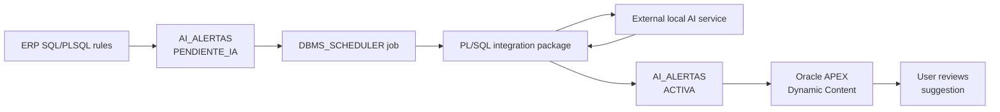

# Oracle APEX ERP Dashboard AI Suggestions

## Oracle Products Used

- Oracle APEX
- Oracle Database
- PL/SQL
- SQL
- SQLcl
- DBMS_SCHEDULER
- UTL_HTTP
- ORDS

## Contribution Type

- Product Usage
- GitHub Code
- Screenshots and Documentation

## Date Created

June 2026

## Summary

This contribution documents a practical Oracle APEX dashboard use case: showing
AI-assisted operational suggestions directly inside an ERP dashboard. The user
sees compact suggestion cards in APEX, but behind them there is a full Oracle
stack: database rules, PL/SQL, scheduler processing, and a reusable CLOB
rendering pattern for Dynamic Content regions.

The external AI service is only used to help write the recommendation text.
Oracle APEX and Oracle Database remain the center of the solution: they provide
the page, the session context, the security filters, the alert lifecycle, and
the final user experience.

## What I Built

- A reusable Oracle APEX suggestion region for ERP dashboards.
- A PL/SQL `RETURN CLOB` pattern for APEX Dynamic Content.
- A database-backed alert lifecycle using `AI_ALERTAS`.
- Background processing with `DBMS_SCHEDULER` so APEX pages stay responsive.
- Sanitized SQL and PL/SQL examples for public review.
- A screenshot-based evidence set for the Oracle ACE Product Usage milestone.

## Architecture



## APEX Pattern

The APEX page uses a Dynamic Content region or a dashboard package that returns
HTML as CLOB:

```plsql
RETURN app_ia_alertas_pq.dashboard_sugerencias_clob(
  p_no_cia          => :GLOBAL_CIA,
  p_centros         => :GLOBAL_CENTRO,
  p_modulo          => 'FACTURACION',
  p_dashboard_scope => 'GENERAL',
  p_usuario         => :APP_USER,
  p_limite          => 5
);
```

## Evidence Included

- [Product usage documentation](docs/oracle-apex-ai-suggestions-product-usage.md)
- [Screenshots](screenshots/README.md)
- [APEX configuration notes](apex/dynamic-content-region-example.md)
- [SQL schema example](sql/ai_alertas_schema_example.sql)
- [PL/SQL package example](plsql/app_ia_alertas_pq_example.sql)

## What I Learned

- How to keep Oracle APEX responsive by processing long-running work in the
  background.
- How to use PL/SQL `RETURN CLOB` to render reusable APEX dashboard regions.
- How to protect visibility with tenant, center, user, and role filters.
- How to document an external integration while keeping Oracle APEX as the main
  product usage evidence.
- How to publish useful examples without exposing sensitive ERP data.

## Privacy Notes

This public contribution uses sanitized examples. It does not include
production credentials, private endpoints, customer data, fiscal identifiers,
tokens, or complete proprietary business logic.

## ACE Submission Text

```text
Product used: Oracle APEX, Oracle Database, PL/SQL, SQLcl and ORDS.

This GitHub repository documents hands-on Oracle APEX product usage through an
ERP dashboard that displays AI-assisted operational suggestions. Oracle APEX is
used as the dashboard and user experience layer, while Oracle Database and
PL/SQL provide the alert lifecycle, security filters, background processing and
CLOB-based Dynamic Content rendering.

The external AI service is used only as an integration point. The Oracle product
usage demonstrated is Oracle APEX, Oracle Database and PL/SQL.

The repository includes public documentation, sanitized SQL and PL/SQL examples,
APEX configuration notes, and screenshots showing the implementation in use.
```
