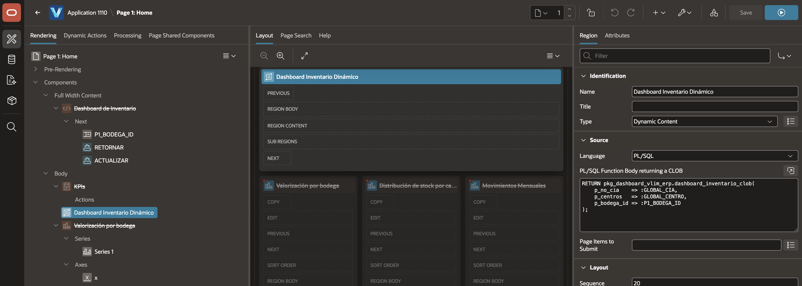
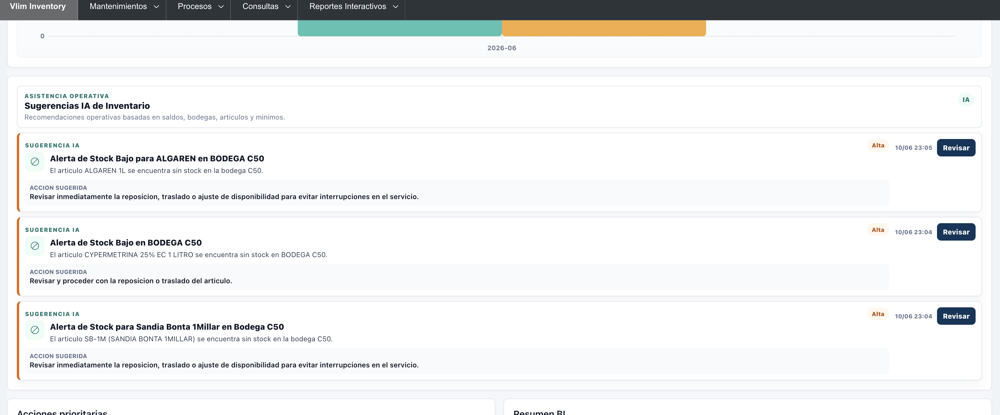
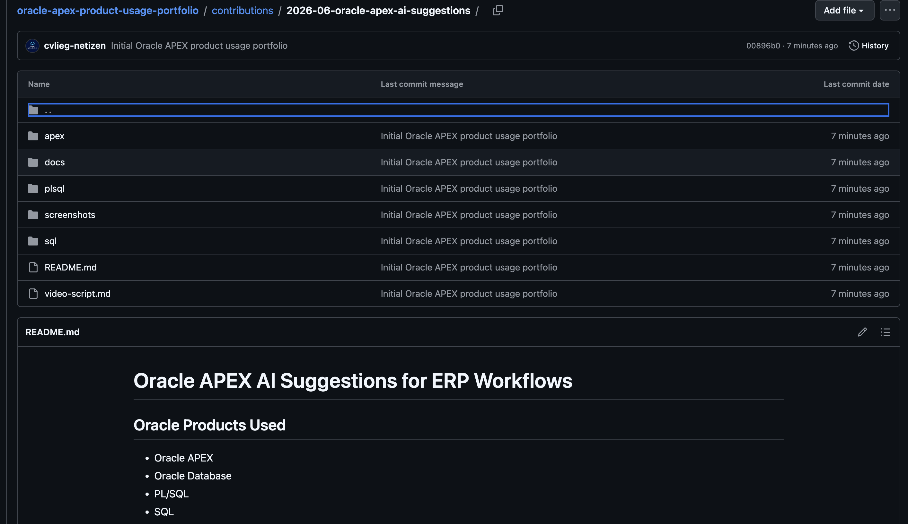
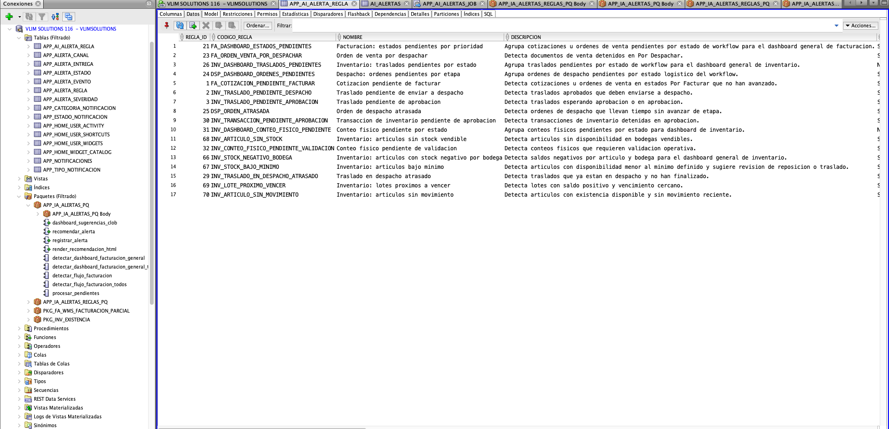
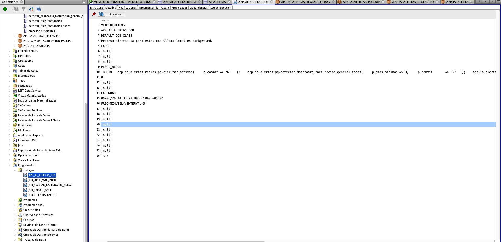

# Screenshots

Sanitized screenshots for the Oracle APEX AI Suggestions product usage contribution.

## Evidence

### 1. Oracle APEX Page Designer

Oracle APEX Page Designer showing a Dynamic Content region powered by a PL/SQL function returning CLOB.

### 2. Oracle APEX Runtime Dashboard

Oracle APEX runtime dashboard displaying AI-assisted operational suggestions for inventory.

### 3. GitHub Product Usage Repository

GitHub repository containing public documentation and sanitized Oracle APEX, SQL and PL/SQL examples.

### 4. Oracle Database AI Alert Rules

Oracle SQL Developer showing configurable AI alert rules stored in Oracle Database.

### 5. Oracle Scheduler AI Job

Oracle Database Scheduler job processing pending AI suggestions in the background.

## Notes

These screenshots were cropped from original local captures to focus on Oracle APEX and Oracle Database product usage evidence. Original raw screenshots are not included in this public repository.
