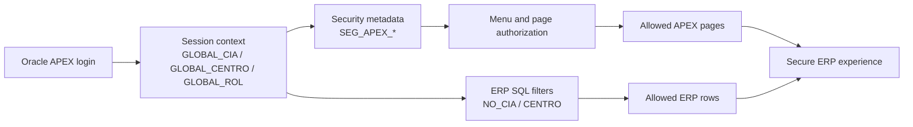

# Oracle APEX Multi-Tenant Security for ERP Applications

## Oracle Products Used

- Oracle APEX
- Oracle Database
- PL/SQL
- SQL
- SQLcl
- ORDS

## Contribution Type

- Product Usage
- GitHub Code
- Screenshots and Documentation

## Date Created

June 2026

## Summary

This contribution documents a practical multi-tenant security pattern used in an
Oracle APEX ERP environment. The implementation separates tenant context,
operating company context, page/menu authorization, role assignment, and
row-level visibility so users only see the ERP information they are allowed to
work with.

The pattern is based on a real ERP implementation where `NO_CIA` identifies the
tenant and `CENTRO` identifies the operating company or branch context. Oracle
APEX session items carry the current context, while Oracle Database tables and
PL/SQL logic enforce access through roles, menu metadata, and query filters.

## What I Built

- A multi-tenant APEX security model based on tenant and operating company
  context.
- Role-based page and menu visibility using database-backed metadata.
- SQL patterns for filtering ERP data by `NO_CIA`, `CENTRO`, and user roles.
- PL/SQL helper patterns for reusable authorization checks.
- A screenshot-based evidence checklist for Oracle ACE Product Usage review.
- Public, sanitized examples that explain the implementation without exposing
  customer data or proprietary rules.

## Architecture



## APEX Pattern

APEX pages and regions use session context values when querying operational ERP
data:

```sql
where x.no_cia = :GLOBAL_CIA
  and x.centro in (
        select column_value
        from table(apex_string.split(:GLOBAL_CENTRO, ':'))
      )
```

Menu and page visibility is backed by role metadata instead of hardcoding page
access in individual components.

## Evidence Included

- [Product usage documentation](docs/oracle-apex-multitenant-security-product-usage.md)
- [Screenshots checklist](screenshots/README.md)
- [APEX configuration notes](apex/session-context-and-page-security.md)
- [SQL security metadata example](sql/seg_apex_security_model_example.sql)
- [PL/SQL authorization helper example](plsql/apex_multitenant_security_example.sql)

## What I Learned

- How to keep tenant and operating company scope explicit in Oracle APEX
  applications.
- How to use Oracle Database metadata to centralize menus, roles, and page
  access.
- How to avoid hardcoded authorization rules in individual APEX pages.
- How to combine APEX session state with SQL and PL/SQL filters for practical
  ERP row visibility.
- How to document security patterns publicly without exposing real users,
  company names, endpoints, or credentials.

## Privacy Notes

This public contribution uses sanitized examples. It does not include
production credentials, private endpoints, user records, customer data, fiscal
documents, personal data, or complete proprietary business logic.

## ACE Submission Text

```text
Product used: Oracle APEX, Oracle Database, PL/SQL, SQLcl and ORDS.

This GitHub repository documents hands-on Oracle APEX product usage through a
multi-tenant ERP security pattern. Oracle APEX is used as the application and
session context layer, while Oracle Database and PL/SQL provide role metadata,
menu authorization, tenant filters and reusable security checks.

The implementation demonstrates how ERP pages can protect data by tenant
(`NO_CIA`), operating company or branch (`CENTRO`), and role-based page access.
The repository includes public documentation, sanitized SQL and PL/SQL examples,
APEX configuration notes, and a screenshot checklist showing what was validated
in the product.
```
